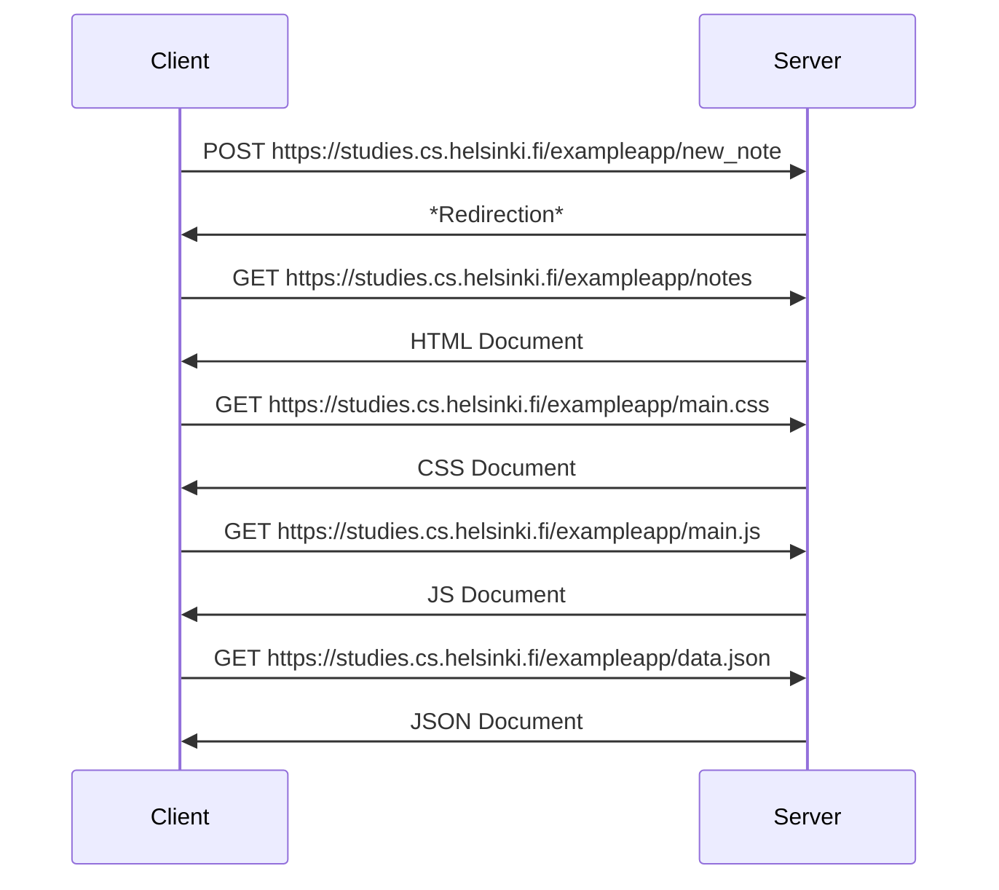
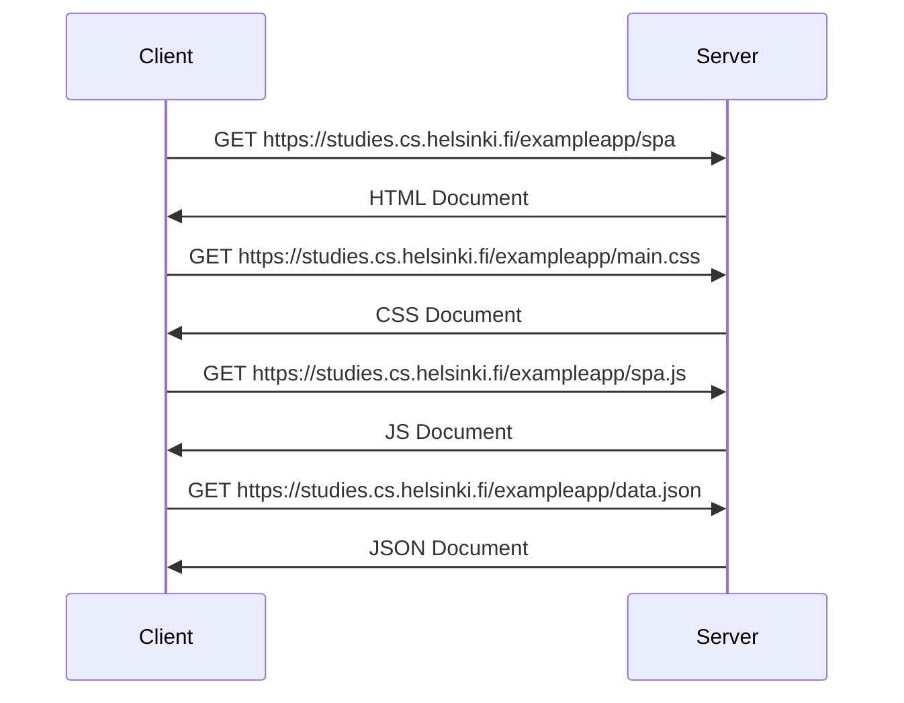
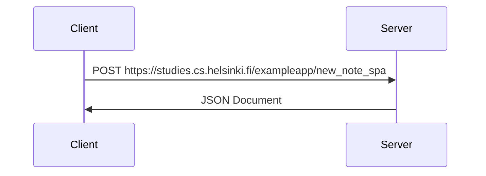

# Part 0
### 0.4
/notes form

```mermaid

sequenceDiagram

Client->>Server: POST https://studies.cs.helsinki.fi/exampleapp/new_note
Server->>Client: *Redirection*
Client->>Server: GET https://studies.cs.helsinki.fi/exampleapp/notes
Server->>Client: HTML Document
Client->>Server: GET https://studies.cs.helsinki.fi/exampleapp/main.css
Server->>Client: CSS Document
Client->>Server: GET https://studies.cs.helsinki.fi/exampleapp/main.js
Server->>Client: JS Document
Client->>Server: GET https://studies.cs.helsinki.fi/exampleapp/data.json
Server->>Client: JSON Document

```
### 0.5
/spa

```mermaid

sequenceDiagram

Client->>Server: GET https://studies.cs.helsinki.fi/exampleapp/spa
Server->>Client: HTML Document
Client->>Server: GET https://studies.cs.helsinki.fi/exampleapp/main.css
Server->>Client: CSS Document
Client->>Server: GET https://studies.cs.helsinki.fi/exampleapp/spa.js
Server->>Client: JS Document
Client->>Server: GET https://studies.cs.helsinki.fi/exampleapp/data.json
Server->>Client: JSON Document

```
### 0.6
/spa form

```mermaid

sequenceDiagram

Client->>Server: POST https://studies.cs.helsinki.fi/exampleapp/new_note_spa
Server->>Client: JSON Document

```